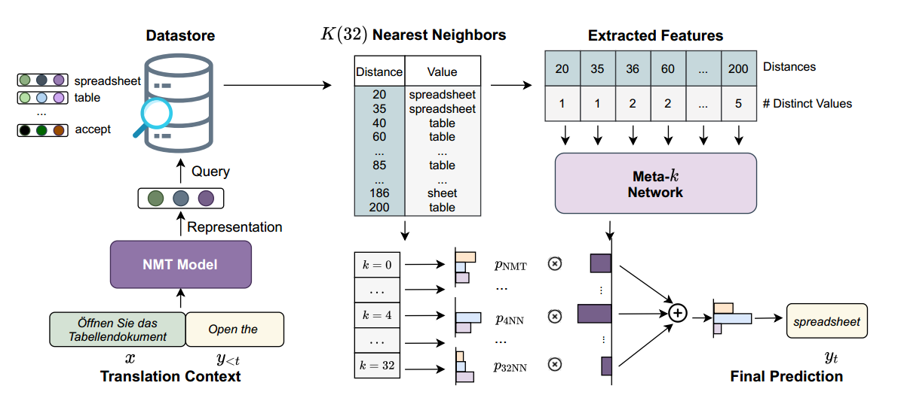

# Adaptive Nearest Neighbor Machine Translation

*** 
## Abstract:
* **问题**：传统的kNN-MT对每个target token，检索的最邻近neighbors数量是相同的，当检索的neighbors存在噪音项时，会导致预测结果的错误
* **本文提出的解决方式**：动态地决定每个target token的k值
  > 具体实现：
  >* 轻量级Meta-k网络：可高效训练（仅用较少的训练examples）
* **成果**：经测试得，该方法能够有效地过滤检索结果中的噪声，且显著优于原模型

* 文章特别提到了**模型的通用性**：在一个领域学习的Meta-k网络可以直接应用到其他领域，并获得一致的改进

***

## Background：

### Retrieval-based methods:
* 背景：在machine translation领域，近年来得到了重视
* 作用：尽量减轻模型在翻译领域外句子、稀有词时表现差的情况
* 特点：之前论文提到的：
  * scalable
  * adaptable
  * interpretable

 

## kNN-MT存在的问题：
* k值固定，当target token难以确定（如：datastore没有足够的相关上下文时：固定的k导致噪音引入
* 翻译质量对k的选择非常敏感，k能够影响模型的鲁棒性和泛化性

******

## Adaptive（进行改进）:
#### k值从一个可能k值集合中取（该集合中的k值小于一个上界K）
  
取值方法：**$k\in S,\quad S = \{0\}\quad\bigcup\quad \{k_i\in N \quad|\quad log_2k_i\in N, k_i\leq K\}  $**

(0代表忽略kNN，仅使用NMT的情况)

 

#### 在给出target token后，模型得到检索结果，改进模型：使用轻量级Meta-k Network来估计每个结果的重要性
实现方法：
  1. 检索出 K neighbors：**$N^t = \{ (h_i,v_i),i \in \{1,2,...,k\} \}$**
  2. 对 K neighbors：
     * 求出其与目标上下文的 representation 的差距（distance）：**$d_i = d(h_i,f(x,\widehat{y}_{<t} ))$**
     * 求出其与目标上下文的不同值的个数$c_i$
  3. 将$d = (d_1,...,d_k)$与$c = (c_1,...,c_k)$作为输入特征（input features）连接到 Meta-k network 中
  4. **Meta-k Network**：$f_{Meta}(.)$：
     * 构造：2个前馈网络，它们之间的关系是非线性的
     * 计算 使用每个kNN预测结果（即k neighbors）的概率 ：
     **$$ p_{Meta}(k) = softmax(f_{Meta}([d;c])) $$**

  5. 做出预测：放弃原来kNN使用的超参数$\lambda$，由于Meta计算的值代表了一个kNN检索出的neighbor的可靠率，则该neighbor的value作为最终预测结果的概率为：
   **$$p(y_t|x,\widehat{y}_{<t}) = \sum_{k_i\in S}p_{Meta}(k_i)\cdot p_{k_iNN}(y_t|x,\widehat{y}_{<t})$$**

原理：
  1. distance是估计当前上下文与neighbor上下文最直接的依据
  2. 检索出的结果的值分布（the value distribution）十分重要：当结果的值差异较大时，kNN的预测结果可行度较低，应该更依赖于NMT的预测

 

#### 训练
* 固定NMT模型
* 通过最小化上述 $p(y_t|x,\widehat{y}_{<t})$ 公式的交叉熵损失来优化Meta-k网络

#### 图示

