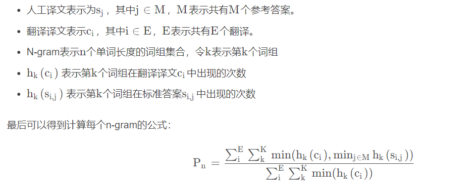

## BLEU 

****
### 概述
* 全名：bilingual evalution understudy，即：双语互译质量评估辅助工具（代替人对机器翻译结果进行评估）
* 背景：随着自然语言处理的快速发展，对机器翻译结果的评估变得重要，需要快速准确的判断翻译结果
* 设计思想：比较机器翻译与人工翻译，结果越相似，评估分数越高

* 比较单位：句子，而非词组或单词
* 准确性：BLEU评估方法的目标是给出快速且一般正确的评估结果，无法做到完全准确：
* 优点：
  > 1. 方便，快速，几乎准确
  > 2. 计算代价小
  > 3. 与语言无关

* 缺点：
  > 1. 不考虑语法上的准确性
  > 2. 测评精度收到用词的影响
  > 3. 当译句较短时，评估分数有时会偏高
  > 4. 未考虑近义词的情况，可能出现正确的结果被否认

***
### 具体实现：
* n-gram 方法：以n个词为单位，进行匹配，若机器翻译中的词组出现在参考中，认为匹配成功
**$$p = \frac{ \sum 匹配成功词组}{ \sum 总词组} $$**
 

* 未考虑人工翻译结果中的词组出现次数，可能出现：
  > 机器译文：the the the the 
  人工译文：The cat is standing on the ground
  ---->  该情况下：the全部匹配，BLEU=1.0，明显错误

    故：更改分子计算方式，当某词组出现多次时，用 **$count_{k} = min(c_k,s_k)$** 计算
    (即：机器翻译疑问中第k个词的匹配次数为：该词组在机器译文的出现次数与该词组在参考译文中的出现次数的较小者)
  
 
  
* n-gram的计算机存在一个问题：
  > 一个翻译引擎只翻译出了句子中部分句子且翻译的比较准确，那么它的匹配度依然会很高
  
  为了避免这种评分的偏向性，BLEU在最后的评分结果中引入了长度惩罚因子(Brevity Penalty)
  
  * 计算方法：
  $$ 
  BP = \begin{cases}
  1,\quad if\quad l_c < l_s \\ 
  e^{1-\frac{l_s}{l_c}},\quad if\quad l_c \leq l_s \\
  \end{cases} 
  $$

 

* 综合考虑各个阶（n-gram的不同n）的结果：
  由于各N-gram统计量的精度随着阶数的升高而呈指数形式递减，所以为了平衡各阶统计量的作用，对其采用几何平均形式求平均值然后加权，再乘以长度惩罚因子，得到**最后的评价公式**：
  **$$BLEU = BP \times exp(\sum^N_{n-1}W_nlog(P_n))     $$**
  * BLEU的原型系统采用的是均匀加权，即$W_n = 1 / N$
  * N的上限取值为4，即最多只统计4-gram的精度

***
### 注释：
  * $P_n$计算方法:
    

