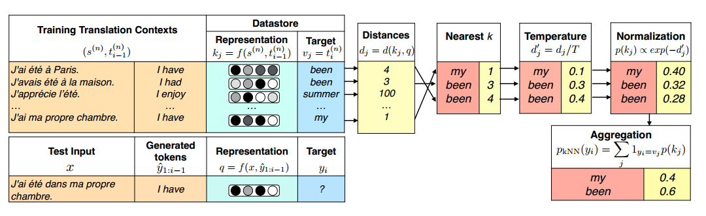
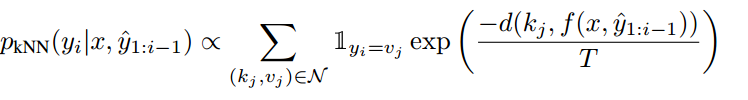
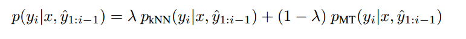
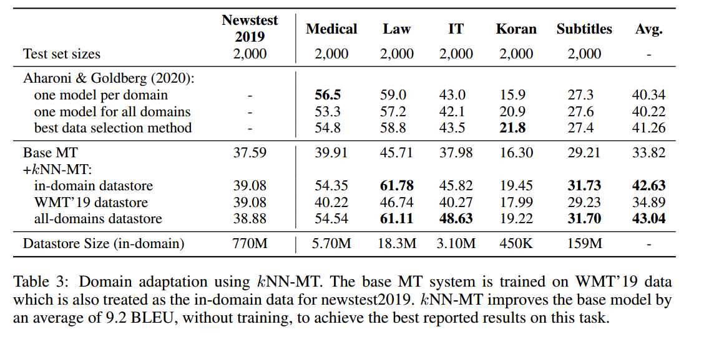
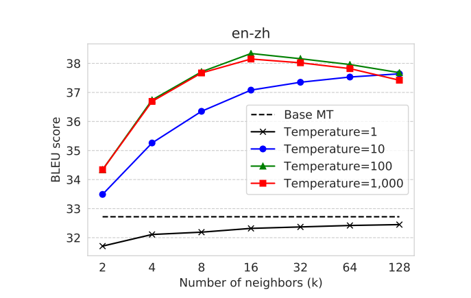

# Nearest Neighbor Machine Translation
***

## Abstract：
* **k-nearest-neighbor machine translation(kNN-MT)**:
> 方法：
> 1. 使用**最近邻分类器**（nearest-neighbor classifier）在缓存大量示例的数据存储上预测 tokens
> 2. 使用神经翻译模型的表征（representation）进行相似性搜索  
  
  > 优点：
  >* 该方法可以直接访问数十亿个示例，无需增大训练或者扩大模型，从而产生一个高度表达（highly expressive）的模型，能够在许多集合中都提高性能
  >* kNN-MT允许一个模型通过使用针对某领域的数据集来适应该领域，无需进行针对该领域的训练

  > 概括：
  >* 简单地说，kNN通过结合源语境（context）和目标语境来检索高度相关的示例（example）

***
## 背景:

* 非参数方法（None-parametric）已经成功用于语言建模和问题回答，模型具有优点：
  * expressive：由于在测试时可以使用任意数量的数据
  * adaptive：预测结果可以通过改变数据集来改变
  * interpretable（可解释性）：用于预测的数据可以被直接检测

*kNN-MT属于非参数方法，可以添加到任何预训练的神经翻译模型中，无需进一步训练，就能提高模型在领域内、领域外、多语言的性能*

***

## 概述：
* 先用神经机器翻译模型通过最近邻搜索法在数据集缓存的示例中生成多项式
* 再对目标token的softmax分布做插值
> kNN-MT interpolates the target-token softmax distribution from a neural MT model with a multinomial generated using nearest neighbor search over examples cached in a data store
* 数据缓存覆盖了需要翻译的上下文（包括原文以及前缀部分）
* 论文假设：表征空间相似的上下文更有可能被相同的词汇跟随

 

kNN相对于其它非参数方法的优点：
   * simpler：无需训练
   * expressive：在推理期间允许模型访问数十亿个键值对

 

实验表现：
* 翻译：将最先进的德语英语翻译模型提高了1.5 BLEU
* 适应性：
  * 适应领域外任务：通过简单地添加某特定领域的数据集，取得的结果比基本模型平均提高9.2 BLEU，甚至优于在这些领域上训练的现有模型
  * 多语言模型适应特定语言对（particular language pairs）的任务：将英语翻译成德语和汉语提高了3 BLEU，发现kNN-MT检索通常是高度上下文相关的

***

## 模型实现：
* 在kNN模型中，由context生成tokens不仅要考虑完整的源语句，而且要考虑之前生成的tokens：
  * source sequence：$s = ( s_1,...,s_{M1})$ 
  * tokens: $t = (t_1,...,t_{M2})$
  * **$p(t_i|s,t_{1:i-1})$**

 
### Datastore
* Datastore为键值对形式（key-value），包括训练集中所有并行数据的上下文表征（context translation representation）以及对应的 target tokens
* key：被预训练模型表征的源语句+目标语句的前缀，一般使用预训练模型decoder最后一层隐藏层向量作为<源语句，目标语句前缀>表征
* value：目标语句前缀的下一个单词
  
datastore 生成公式如下：
  **$$(K,V) = \{(f(s,t_{1：i-1}),t_i),\forall t_i \in t | (s,t)\in (S,T)\}$$**
  * f：将input的源语句+前缀映射为中间表征
  
### 文本生成：
* 在进行翻译时，可使用类似方法得到 <源语句，目标语句前缀> 的表征，再使用kNN算法，将我们得到的表征与datastore中的表征进行比较，得到k个最邻近的\<key, value\>对，并将其value作为候选单词
* 再用键值对的key间的距离作为权重，得到各个value的概率，公式如下：
  

* 改进：提高模型在没有缓存的示例时表现：对kNN概率和预训练模型新词的概率进行线性插值，公式如下（$\lambda$：超参数）
  

***
## 实验：
### 跨领域适应性
除了single language—pair translation和multilingual machine translation外，论文还进行了**Domain Adaption**的实验，实验结果表明：
* 在不加入额外训练的情况下，训练好的模型+特定领域的datastore可以大幅提升模型表现

***

### Softmax Temperature & the Number of Neighbors
* softmax temperature在估计最邻近分布时使用，temperature的提高有利于将概率分配给多个neighbor，提高模型的多样性
  
 

* 本文应用：
  * temperature=1：BLEU显著降低；temperature=10/100 被证明是最优
  * neighbors：当检索的neighbors数量较大时，模型性能并未提高，甚至有些下降，说明检索过多的neighbors会添加噪声，导致结果恶化
  * 图示：
  

 
  
* softmax temperature参考：https://zhuanlan.zhihu.com/p/504323465

