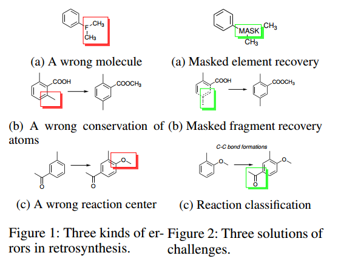
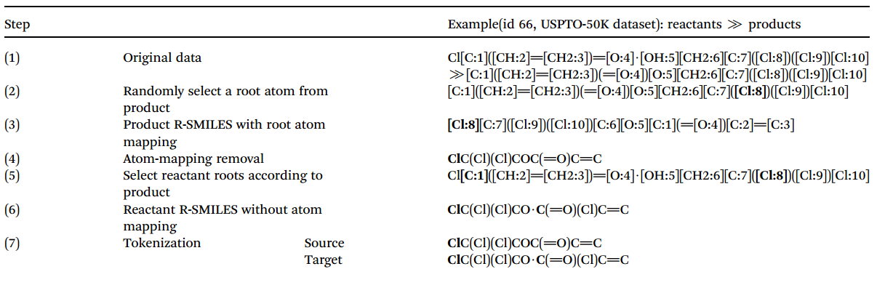
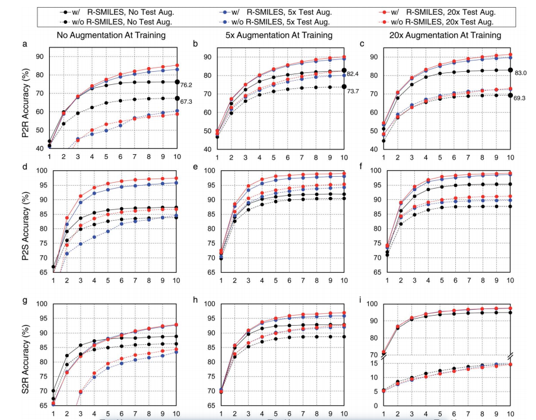
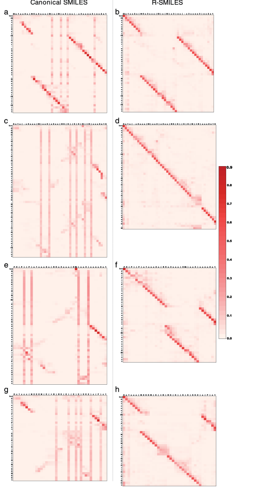
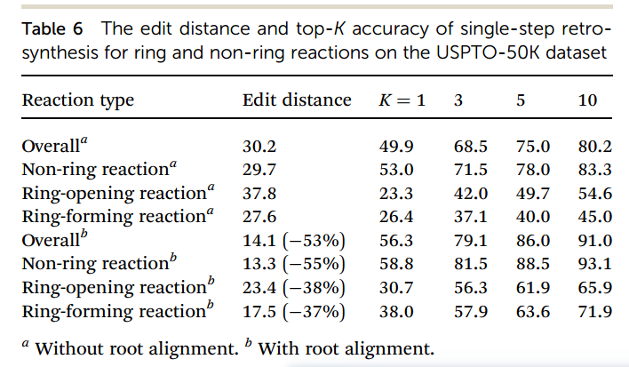

# Root-aligned SMILES
 a tight representation for chemical reaction prediction
***

## 文章概要:
***
### 问题：
#### 1. 难以突出化学反应中的变化
* 在计算机辅助的化学逆合成中，常使用Smiles来进行分子表示，但在化学反应中，从反应物到产物的分子图拓扑结构在很大程度上是不变的，这导致如果直接应用SMILES，其性能不是最优的  
  
*（理解：Smiles用字符串来表示分子特征，这导致其需要描述完整的分子结构，难以突出变化的部分）*  

  

#### 2. SMILES对应多个输出
* Smiles是通过对分子图进行深度优先遍历生成的，因此分子可以有多个有效的Smiles表示，这导致对于给定的输入SMILES存在多个正确的输出SMILES，输入和输出间的一对多映射使得合成预测极具挑战性，因为计算模型不仅要学习化学反应的化学规则，还要学习用于SMILES字符串有效性的SMILES语法
  
* 现存几种规范化方法来生成规范化的SMILES，以确保分子和SMILES之间的一对一映射。但这些方法没有考虑生成物和反应物分子之间的关系，导致了很大的SMILES输入输出差异，而输入输出的差异使反应物的搜索空间很大，降低了合成预测模型的性能。图示如下：

***
### 解决方式：
* 提出 Root-aligned SMILES

* 由于其具有严格的一对一映射关系，并且分子的编辑差距（edit distance）减小，使计算模型在很大程度上从学习复杂的语法中解放出来，而专注于学习反应的化学知识

***
### Root-aligned SMILES:
#### 原理：
* 在处理化学反应时，R-SMILES 采用相同的原子作为生成物和反应物的SMILES字符串的根(即起始原子)（如上图所示）

* 该方法使输入和输出Smiles具有一对一映射关系，且高度相似。而输入和输出之间的高度相似性使得使用R-SMILES的综合预测非常接近典型的自编码问题，且可以减少对相同部分的关注，注重分子变化的部分

#### 提出模型：
* **基于transformer的自编码器**：transformer-based autoencoder

* **预训练**：通过用易于获得的未标记分子数据预训练模型，使模型学习简单的分子表示（compact molecular representation），并掌握必要的 SMILES 语法

* **finetune**：利用反应数据对模型进行微调，模型从复杂的语法学习中解脱出来，专注于学习反应的化学知识

#### 具体流程：

流程可以概括为：
1. 随机选择根原子（root atom）
2. 基于根原子生成生成物的 R-SMILES，剔除多余部分
3. 对反应物进行相同处理，最终得到简化的生成物以及反应物的Tokenization表示

#### 进行实验：
* 大量的实验（包括生成物到反应物、生成物到合成物、合成物到反应物以及反应物到产物）都证明了R-SMILES的效率

***
### 结论：
* R-SMILES在与各种最先进的baselines的比较中，R-Smiles取得了更好的结果

#### 关于最小编辑距离（minimum edit distance）
* 定义：最小编辑距离，即：化学反应所需的最少编辑操纵数（编辑操作包括：插入、删除和替换）

* 最小操作数可以用来衡量输入和输出的smile之间的差异

* 在本实验中，R-SMILES有效地降低了最小编辑距离，但是为了减小过拟合的影响，许多模型会使用随机化 SMILES进行数据增强，这一点会影响模型的综合性能

#### 数据增强的应用（data augmentation）
* 在反合成预测中，数据增强可以同时应用于训练数据和测试数据，也可以只应用于其中一个
* 本文为了测试数据增强后R-SMILES的性能，对训练数据和测试数据分别进行不同次数的增强
* 实验结果：

1. R-SMILES始终优于普通的SMILES
   
2. 如果没有应用训练数据增强(图2a, d，g)，对测试数据进行增强通常会降低规范SMILES的性能
3. 随着训练数据的增加，R-SMILES可以产生更高的准确率
4. 在无R-SMILES，如果使用过多的训练数据增强，模型可能会产生较差的性能
（原因：如果在没有R-SMILES的情况下进行过多的训练数据增强，反合成任务就会变成如图1所示的一对多问题，模型很难学习到有用的化学知识进行反合成。但是，如果不使用训练数据增强，则模型可能很容易出现过拟合的问题，这使模型需要权衡数据增强）
**（这一点侧面体现出了R-SMILES的优势）**

#### 用可视化交叉注意力机制来看R-SMILES
* 交叉注意力可以表现出反应物token和生成物token之间的相关性：
  

* 通过可视化的方法来判断预测的好坏：
重点看交叉注意力图是否有序而集中，当注意力分散时，模型无法做出好的预测
* 如上图中：第一行反应物与生成物差距小，Smiles与R-Smiles性能类似
* 如上图中：后2行：产品和目标反应物的SMILES差异很大，使用SMILES训练的模型无法对齐（align），被迫关注全局信息，最终导致注意力图混乱，预测失败；然而，由于RSMILES对（pairs：指反应物与产物组成的对） 的差异较小，在图3f和h中，使用RSMILES训练的模型给出了有序的注意图，并成功地预测了目标R-SMILES
* **结果表明，R-SMILES有效地使模型专注于学习反应的化学知识，从而提高了模型预测的准确性**

 
#### 该技术的问题
* 输入和输出字符串之间的较大编辑距离将降低反应预测性能
* 这一点体现在含环的化学反应中，与非环反应R-SMILES相比，环反应的编辑距离显著增大，而R-SMILES有其自身的局限性使编辑距离过大时，模型表现降低：
  

